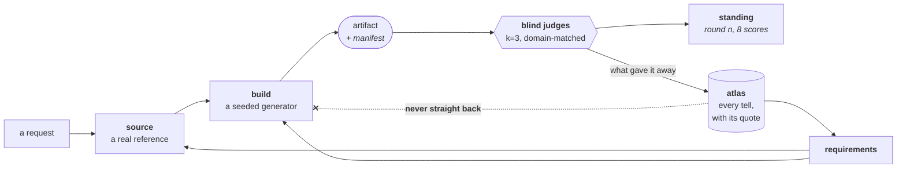

# verismill

**Synthetic documents that hold up to expert scrutiny — and the score that says
how well.**

If you're building anything that reads documents — a review agent, an
extraction pipeline, a detection model — you need documents to test it on. The
real ones belong to clients and can't leave. So you generate some, and hit two
problems: they're too clean to be a real test, and you don't know what's wrong
with them, so you can't score anything.

verismill generates documents that survive a second look from a domain expert,
plants defects you can score against, and measures how realistic the output
actually is — publishing the number even when it's bad.

Anything can generate a document that looks right. This one tells you how it
scored.

## Three things, and nothing else

```
prompt    .claude/skills/    the lifecycle an agent runs
climber   src/verismill/     the bus, the atlas, the judge harness
result    libs/mattermill/   seeded document classes
```

Plus `.foundry/` — gitignored — where the operating agent writes what it is
climbing and what it has measured. That state is one foundry's findings, not
the instrument, so a clone carries the machinery and starts its own.

## What it does

You ask for a document class. *An ACORD 126. A 1642 bill of sale for a ship.*

**It sources a real one first.** The actual blank form at the actual edition,
or a photograph of a real original — never an approximation from memory. Our
first ACORD 126 was written from memory, looked convincing, and carried two
sections belonging to a different form. An underwriter spotted it in seconds.

**It builds a generator, not a document.** Derived values are computed from
their inputs rather than sampled beside them, and fields that could contradict
each other read from the same variable. Same seed in, identical bytes out,
offline, every time. Every artifact ships a manifest, so anyone holding it can
reproduce the file exactly.

**It plants defects as single deltas.** A defect changes exactly one displayed
value while everything around it stays honest — which makes a planted fault
provable rather than ambient noise, and lets you score whether your reviewer
caught it.

**Then blind judges try to catch it.** Domain-matched readers, three per
artifact, no provenance, no repo access. They score eight dimensions and quote
the evidence behind every failure.

A class never claims to be realistic. It reports the round that judged it and
what it scored.

## The loop



Two edges carry the design.

The **return path** means a finding is never patched where it surfaced. It goes
back to the stage that can absorb it: a wrong value moves the sampler, a
missing form edition moves sourcing. Patch the document and you've fixed one
file. Move the stage and you've fixed the generator.

The **severed edge** is why the scores mean anything. The builder never learns
which specific tell it's fixing — findings arrive as requirements (*"fields
that can contradict each other must read from one variable"*), never as answers
(*"the underwriter noticed page 2 says yes and page 3 says no"*). A builder who
can see the scoreboard optimizes for the scoreboard.

## The receipts

A commercial-lines underwriter scored our ACORD 126 at 62/100 — arithmetic 96,
cross-field consistency 43. Answers now couple at the sampler, and the rubric
gained two dimensions it had been blind to.

Three blind judges called a 1642 bill of sale synthetic at 0.95 confidence:
cross-field **78**, forensic authenticity **5**. We'd sourced the words from an
1894 scholarly edition and nothing about the object. So we found a photographed
1613 deed, rebuilt against it, and put both in front of three fresh judges —
who scored ours **43** against the real one's **94**, and identified the
synthetic **3 out of 3** times at 0.97–0.99 confidence.

That round is the reason to trust the rest of this page. It found a defect we
introduced *while fixing the last one*: we copied the wavy indented head off
the 1613 exemplar without noticing that exemplar is an **indenture**, cut to
match a counterpart, while ours calls itself a bill under one seal and should
be cut plain.

Full trace, failure included:
[worked-example-1642.md](.claude/skills/forge-document/worked-example-1642.md).

**Where the round records are.** They are not in this repo, and by design
cannot be: measurement state lives in a gitignored `.foundry/`. The bus,
atlas, briefs, answer keys and verdicts behind the numbers above belong to the
foundry that ran those rounds. What ships here is the instrument that produced
them, the worked example above, and each class's standing in `registry.py` —
so the claim a caller sees and the claim on this page stay one object.

## Standing

A class states the round that judged it, never an adjective.

| Class | Standing | Open |
|---|---|---|
| `acord126` | round 4, external commercial-lines review, 62/100 | registry codes unsourced — they won't survive lookup |
| `underwriting_file` (1993) | round 6, external London-market review, 61/100 | market-practice reference data |
| `msa_1987` | round 5, external family-law review | reviewed qualitatively; no numeric score |
| `bill_of_sale` (1642) | round 9, blind **pairwise**, k=3 — 43/100 against a real 94 | judges 3/3; forensic authenticity **10** vs the real 97 |
| `nj_birth` (1878–1900) | **unreviewed** — never judged | the object is unsourced; no facsimile of the blank was obtainable |
| `acord130` (MN workers comp) | **unreviewed** — never judged | voluntary carrier rates aren't public; NAIC code and NPN left blank on purpose |

A repair made by the session that found the fault is a *harvest*: it moves the
code, not the rung.

The objective is judge accuracy driven to **chance (0.5)**. On the one class
measured pairwise it is **1.0** — every judge, every time. The gap between 43
and 94 is the work remaining, and it is almost entirely physical: the hand is
set type rather than a written secretary hand, and the seal is a flat disc on a
tag that passes through no plica.

```bash
python -m mattermill.cli classes
```

prints this table from the registry, with every open approximation spelled out.

Canon-driven classes take a `canon=` world. The shipped defaults are invented;
supply your own and every place, party and production number in the document
follows from it. Nobody else's facts live in these modules.

Where a class is bound to a jurisdiction, the jurisdiction is a **gate, not a
label**. `acord130` carries one sourced rating world — Minnesota's, from
MWCIA — so asking it for a Wisconsin worksheet raises instead of rendering
Minnesota's arithmetic under another state's name.

## Ask for something that isn't built yet

The catalog isn't the product. The **lifecycle ships**, as skills an agent
runs, so the answer to *"do you support form X"* is *ask for it*:

| Skill | Use when |
|---|---|
| [`forge-document`](.claude/skills/forge-document/SKILL.md) | **the front door** — a plain request for a document; routes the three below |
| [`source-template`](.claude/skills/source-template/SKILL.md) | a real form, transcription, or facsimile must drive the work |
| [`add-emitter`](.claude/skills/add-emitter/SKILL.md) | adding a document type or capability to mattermill |
| [`climb-round`](.claude/skills/climb-round/SKILL.md) | judging artifacts, harvesting a review, fixing, re-measuring |

Honest limit: end-to-end, from one sentence to a judged artifact, has run
once — for the 1642 bill. It's the strongest thing here and the least proven.

## Quick start

```bash
pip install "verismill @ git+https://github.com/jarredparrett/verismill"
```

```bash
pip install "mattermill @ git+https://github.com/jarredparrett/verismill#subdirectory=libs/mattermill"
```

Git URLs rather than PyPI, deliberately: the API is still moving between
rounds, and claiming a permanent index name for an interface we intend to
break is a promise we would have to walk back. Working from a clone instead?
`pip install -e . -e libs/mattermill`.

Ask for a document by name:

```bash
python -m mattermill.cli emit --class bill_of_sale --seed 1642 --out bill.pdf \
    --pin vessel_name=Hopewell --pin share=8
```

You get the artifact, a sidecar manifest that reproduces it byte-for-byte, and
the class's standing printed back — including whatever is still unscored. In
Python it is one call:

```python
from mattermill import registry
pdf, manifest = registry.emit("bill_of_sale", seed=1642,
                              pins={"vessel_name": "Hopewell", "share": 8})
```

The facade owns the metadata, because that is where period honesty lives: a
1642 deed is a *scan*, so its `CreationDate` is the digitisation and its
producer is an overhead scanner — a sheetfed office scanner cannot feed a
membrane, and round 8 lost forensic authenticity on exactly that.

To run the climb yourself rather than just consume it, describe the document
you need and let the agent route it. There is nothing to scaffold: the agent
creates `.foundry/` as it goes.

```bash
python -m pytest tests/ -q && python -m pytest libs/mattermill/tests/ -q
```

## Three loops, three speeds

| | runs | closes when | fixes |
|---|---|---|---|
| **L0** | per build | a capability gate passes or fails | the code |
| **L1** | per round | a judge batch scores | the generator |
| **L2** | when L1 stalls | no current tool can fix a finding | **the instrument itself** |

L2 is the one most systems skip. When a finding can't be fixed by anything the
toolchain can do, you don't push harder — you add a tool. Round 4's review
found a failure class our rubric had no dimension for, which meant the *judges*
were blind, not the generator. Round 8 changed the sourcing procedure rather
than any emitter.

verismill is **agent-operated and human-triggered**. There's no daemon: a
person asks for a round, an agent executes it, and a hash-chained bus records
what happened.

## Not for

Presenting synthetic documents as real to a court, an insurer, a counterparty,
or any human system that will act on them. Entity pools name invented companies
and people; no real person's data appears in any artifact, and a test emits
every class and reads its text layer back to keep that true.

Artifacts carry provenance in a sidecar manifest. There's **no marker embedded
in the rendered bytes** — a strippable one is theatre, a robust one degrades
the realism the research depends on, and the central rendering point that
should apply one doesn't exist yet.

## What's missing

- No autonomous runner. A round is a sequence an agent executes when asked.
- Blindness is discipline, not mechanism — nothing enforces role isolation at
  runtime.
- No single `emit()` entry point beyond the registry facade.
- The climber's own state has no schema. `.foundry/spec.yaml` is a document the
  agent keeps, not a validated artifact; the 650-line validated spec that
  preceded it was 53% comments and read by almost no code.

## Layout

```
.claude/skills/    the lifecycle: forge-document → source · add-emitter · climb-round
src/verismill/
  trace.py         hash-chained event bus, heartbeat + stall detectors
  source.py        reference forms in, template contracts out (authoring-time)
  climb/           atlas (evidence-of-k), blind judge harness, orchestrator
libs/mattermill/   seeded document classes: acord126, acord130, bill_of_sale,
                   msa_1987, nj_birth, underwriting_file — over four
                   primitives: legalpdf, scan, assets, lens
.foundry/          gitignored: spec, atlas, bus, reference, rounds, artifacts
```

## Start here

**[AGENTS.md](AGENTS.md)** — the invariants every contributor and agent works
under: seeded everywhere, coherence by construction, one capability test per
requirement, no network in the render path.

MIT licensed.
