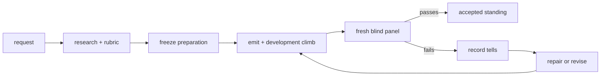

# verismill

**Build seeded synthetic documents, improve them against a frozen rubric, and
preserve the evidence needed to rerun the experiment.**

verismill is for teams testing document reviewers, extraction systems, and
detection models without using confidential client files. It combines:

- `mattermill`: deterministic document generators;
- `verismill`: persisted research, candidates, model receipts, judgments, and
  reports;
- agent skills: the operating procedures for sourcing, building, and climbing.

It does not merely produce a plausible PDF. It records what was researched,
what “good” means, which exact bytes were judged, which models judged them, what
failed, and whether the frozen acceptance rules passed.

## Choose your path

### 1. Generate an existing document class

Install the generator library:

```bash
pip install "mattermill @ git+https://github.com/jarredparrett/verismill-lean#subdirectory=libs/mattermill"
python -m mattermill.cli classes
```

Emit a document:

```bash
python -m mattermill.cli emit \
  --class bill_of_sale \
  --seed 1642 \
  --out bill.pdf \
  --pin vessel_name=Hopewell \
  --pin share=8
```

The output includes a sidecar manifest containing the class version, seed,
pins, artifact hash, and planted-defect ground truth. The same version, inputs,
and seed produce byte-identical output.

Python callers use the registry facade:

```python
from mattermill import registry

pdf, manifest = registry.emit(
    "bill_of_sale",
    seed=1642,
    pins={"vessel_name": "Hopewell", "share": 8},
)
```

### 2. Run a document experiment

Install both libraries from a clone:

```bash
python -m venv .venv
. .venv/bin/activate
pip install -e . -e libs/mattermill pytest
```

The recommended interface is an agent operating the lifecycle skills. Ask in
plain language:

```text
Use forge-document to build a 1997 residential deed for Madison, New Jersey.
Continue the experiment for another repair and evaluation cycle.
Rerun the blind evaluation with a different model panel.
```

The agent should show its current role, preserve builder/judge blindness, and
write every transition into one experiment directory. `forge-document` includes
the blind panel: development selection seals the candidate and the agent
continues through measurement without requiring another user prompt.

The lifecycle is:



The equivalent CLI starts in the operator's data directory, outside the
clone. `VERISMILL_HOME` can override that location:

```bash
verismill init --id madison_deed_1997 \
  --request "A deed to a house in 1997 in Madison, New Jersey"
EXP="$(verismill home)/experiments/madison_deed_1997"

verismill source "$EXP" \
  --name recorded-deed-reference \
  --file references/recorded-deed.pdf

verismill prepare "$EXP" \
  --research research.json \
  --requirements requirements.json \
  --rubric rubric.json

verismill status "$EXP" --json
verismill verify "$EXP"
```

Builder and judge invocations are provider-neutral `agent-run` receipts. After
registering those receipts, the experiment records candidates, development
selection and automatic sealing, blind evaluation, tells, and repairs. See
[docs/experiment.md](docs/experiment.md) for the complete Python and CLI API.

Blind scores are never accepted as caller-authored JSON. `verismill judge`
derives them from the persisted judge receipts using an explicit scorer:

```bash
verismill judge "$EXP" --mode absolute \
  --judge-run sha256:<receipt-1> \
  --judge-run sha256:<receipt-2> \
  --judge-run sha256:<receipt-3>
```

After development selection, authorize the exact Candidate with either
`Experiment.record_human_review()` or an independent, receipted
`approval_reviewer` run followed by `Experiment.record_agent_approval()`.
The agent reviewer must have a different principal and context from every
builder, fixer, and development judge. Provider adapters can then call
`Experiment.run_absolute_blind_measurement()` to invoke, persist, and score the
complete model panel in one operation. `PanelExecutionPolicy` bounds concurrent
workers, retries, calls, and tokens; the panel receipt preserves which exact
human or agent authorization permitted execution. Incomplete panels retain
receipts but produce no standing.

Downstream products materialize an emitted candidate through the public
experiment facade rather than reading the experiment's object store:

```python
result = experiment.artifact_result(candidate_ref)
pdf_bytes = result["artifact"]
manifest = result["manifest"]
attestation = result["attestation"]
```

The attestation binds the exact bytes and manifest to the experiment revision,
frozen rubric and requirements, emitter version, measurement state, standing,
and a fresh verification result. A downstream content-addressed store can copy
the result without retaining a filesystem dependency on the experiment.

Useful recovery commands:

```bash
verismill status "$EXP" --json       # what happened and what is legal next
verismill replay "$EXP"              # replay recorded events; invoke no model
verismill verify "$EXP"              # verify object hashes and bus chain
verismill report "$EXP" --out report.md
verismill rerun "$EXP" /tmp/eval-rerun --from evaluation
```

### Multi-artifact products

An `ArtifactSuite` composes several exact Experiments without turning a packet
into one monolithic climb:

```python
from verismill import ArtifactSuite

suite = ArtifactSuite.create(
    "/path/to/user-data/observatory-artifacts",
    suite_id="observatory_artifacts",
    request="The independently measured observatory evidence collection",
)

# Create a child Experiment inside the suite workspace, or snapshot an existing
# verified Experiment through the public boundary.
night_log = suite.create_experiment(
    "night_log", request="Forge the observatory night log"
)
# ...freeze, build, approve, and measure night_log through Experiment...
suite.select_member("night_log")
suite.link_experiment("gatehouse_card", measured_gatehouse_experiment)

suite_attestation = suite.attest()
assert suite.verify()["ok"]
artifacts = suite.artifact_results()
```

Every member retains its own rubric, model receipts, Candidate, bus, Artifact
Attestation, and standing. The suite stores relative child bundles, replays all
member buses, and fails verification if a selected child changes. Its
qualification reports accepted, rejected, required, and development-only
member counts; it never averages scores from unlike rubrics. Attestation makes
the selected collection immutable. `suite.revise(..., impacts={...})` creates a
child suite: unchanged members retain exact content-hash attestations, while
impacted members restart before Candidate generation and must be approved and
measured again. See
[docs/artifact-suite.md](docs/artifact-suite.md) for the complete contract.

### 3. Add a document class

Ask the agent to use `forge-document`. It routes the work through:

| Skill | Responsibility |
|---|---|
| [`forge-document`](.agents/skills/forge-document/SKILL.md) | front door and lifecycle routing |
| [`source-template`](.agents/skills/source-template/SKILL.md) | ingest real forms, rules, transcriptions, or facsimiles |
| [`add-emitter`](.agents/skills/add-emitter/SKILL.md) | implement a seeded, coherent generator with capability tests |
| [`climb-round`](.agents/skills/climb-round/SKILL.md) | measure, record tells, repair, and re-measure |

The sourcing gate is deliberate: standard forms, statutory language, registry
codes, and period objects must be built against real references, not memory.

When an experiment exposes an emitter defect, the operating contract does not
leave the repair as private workstation state. The agent records the tell and
asserted repair in the experiment, lands a capability test, runs both suites,
then pushes a `codex/` branch and opens a ready pull request (or updates the
already-open pull request for that scope). A harvest PR is evidence of a repair,
not a claim of blind acceptance.

## What an experiment preserves

Each experiment is a resumable bundle:

```text
experiment.json   small mutable state pointer
objects/          immutable content-addressed inputs and results
bus.jsonl         append-only hash-chained event history
work/             temporary authoring material
```

It preserves:

- the original request and research provenance;
- requirements, rubric, scorer, and acceptance rules;
- references and their hashes;
- candidate PDFs, manifests, pins, seeds, and builder explanations;
- provider/model configuration, prompt and input hashes, raw responses, parsed
  outputs, tool traces, and usage;
- development decisions, blind verdicts, scores, quoted tells, and repairs;
- experiment revisions, reruns, accepted standing, and human-readable reports.

An original model response is replayable because its receipt is stored. Calling
a mutable model alias again is a new attempt, not a claim of identical model
execution.

By default, bundles live under the platform's per-user application-data
directory (`verismill home` prints it), not in the repository. Set
`VERISMILL_HOME` to use a team-controlled or removable data root. An explicit
path passed to `verismill init` or `Experiment.create()` remains supported.

## Running with different models

Models are explicit experimental factors. You can vary:

- the builder model while keeping research, rubric, pins, and seed
  fixed;
- the development judge while comparing candidate selection behavior;
- the blind panel while keeping the candidate bytes and judge protocol fixed.

Freshness is determined by agent identity and context identity, not model
family. The same model may serve different roles in isolated contexts; a blind
judge may not reuse a builder, fixer, development-judge, or prior blind-judge
context.

For a fair model comparison, hold constant the artifact hash, frozen rubric,
persona, response schema, and assigned judge lens. Record the requested
model alias and the most precise resolved revision the provider exposes.

## Design guarantees

1. **Seeded everywhere.** Same version, seed, and inputs produce identical
   bytes.
2. **Coherence by construction.** Derived values are computed from shared facts,
   not sampled independently.
3. **Explicit defect deltas.** A planted defect changes one displayed value.
4. **One capability test per requirement.** Accepted requirements are executable.
5. **Offline rendering.** Network access is authoring-time only.
6. **Forensic and period honesty.** Metadata and physical format match what the
   artifact claims to be.
7. **Load-bearing references.** Forms, rules, and period features are sourced.

Read [AGENTS.md](AGENTS.md) before changing emitters or experiment machinery.

## Local class standing

`mattermill` publishes static capabilities only: names, eras, substrates,
inputs, and package versions. It does not ship scores, rounds, or claims copied
from somebody else's experiment.

```bash
python -m mattermill.cli classes  # static emitter catalog
verismill classes                 # add your verified local evidence
verismill classes --json --strict
```

`verismill classes` scans the operator's experiment collection, verifies each
object graph and bus chain, and derives standing only from accepted blind
evaluations of candidates recorded through `verismill emit` for the installed
emitter version. A generic caller-supplied candidate cannot claim a registered
class. Evidence from an older emitter version is shown as historical, not
current. A class with no qualifying local experiment reports
`local standing: unavailable`.

This makes the ownership boundary explicit: the repository distributes the
instrument; each user or organization owns its rubrics, model receipts,
artifacts, scores, and decisions. Moving or backing up `VERISMILL_HOME` moves
that evidence without changing the library.

## Development

```bash
pip install -e . -e libs/mattermill pytest
python -m pytest tests/ -q
python -m pytest libs/mattermill/tests/ -q
```

Repository layout:

```text
src/verismill/      experiment state, object store, receipts, reports, judges
.agents/skills/     agent-operated lifecycle procedures
libs/mattermill/    seeded document classes and rendering primitives
docs/               public API documentation
```

verismill is agent-operated and human-triggered. It has no autonomous daemon: a
person requests a round, an agent performs it, and the experiment records the
result.

## Responsible use

Do not present synthetic artifacts as genuine documents to a court, insurer,
counterparty, regulator, or any human system that may act on them. Shipped
party and property defaults are invented; period-honest metadata may name real
capture hardware or software. Artifact provenance and planted-fault truth live
in the sidecar manifest; no marker is embedded in rendered bytes.

MIT licensed.
